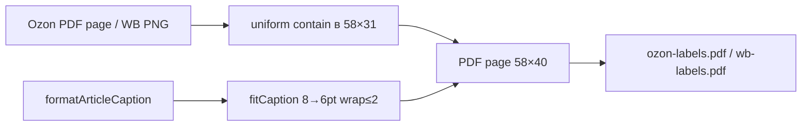

# Creative: PDF layout этикетки 58×40

**Feature:** `stickers-label-generation`  
**Тип:** Algorithm + visual layout  
**Дата:** 2026-08-25  
**Статус:** Решение принято

Связано: `memory-bank/tasks.md` → `stickers-label-generation`

---

## 🎨🎨🎨 ENTERING CREATIVE PHASE: ALGORITHM (PDF LAYOUT)

**Focus:** геометрия страницы 58×40 мм — полоса артикула, кегль, wrap, align, scale оригинала  
**Objective:** штрихкод сканируется, артикул читается с этикетки, layout одинаковый на всём рулоне  
**Не в скоупе:** архитектура сервисов, UI страницы, WB PNG vs PDF (locked в PLAN)

### Constraints (из PLAN)

- Страница = ровно **58×40 мм** (MediaBox)
- Оригинал **сжимается**, артикул **снизу**, не overlay
- Caption: `ART`, `ART x3`, `ART-A, ART-B x2`
- HelveticaBold, ASCII
- Contain, без crop штрихкода, без non-uniform scale
- Принтер термо 58×40, часто клипает край ~1 мм

### Физика

```
1 mm = 72/25.4 pt ≈ 2.8346 pt
PAGE_W = 164.41 pt
PAGE_H = 113.39 pt
```

Типичный артикул `GT-220120-BZ-33-Aquarelle` ≈ 28 символов.  
HelveticaBold 8pt × 28 × ~0.55 ≈ 123 pt. Ширина минус поля 1.5 мм × 2 ≈ 156 pt → **одна строка влезает**.  
Несколько SKU через запятую → 2 строки.

Штрихкод 1D на 58×40 переживает ~75–80% scale. Ниже ~70% (если отъесть >12 мм) — риск.

---

## OPTIONS ANALYSIS

### Option 1: Тонкая полоса 6 мм, 1 строка, ellipsis

**Description:** фиксированные 6 мм снизу, 9pt, одна строка, хвост `…`. Оригинал occupy 34 мм.

**Pros:**
- Максимальный штрихкод (~85% высоты)
- Простейший код, нулевой wrap

**Cons:**
- `ART-A, ART-B x2, ART-C` обрежется — оператор не увидит второй SKU
- 9pt в 6 мм впритык, клип принтера съест baseline
- Ellipsis на складе = «непонятно что клеить»

**Complexity:** Low  
**Риск печати:** Low для 1 SKU, High для multi

### Option 2: Фиксированная полоса 9 мм, wrap 2 строки, 8→6pt, left, contain *(рекомендуется)*

**Description:** все этикетки на рулоне одной геометрии. Контент оригинала = верхние 31 мм. Полоса 9 мм: 1 или 2 строки, left-align. Кегль 8pt, при overflow шаг до 6pt. Contain + центрирование оригинала в верхнем rect. Белая заливка полосы + hairline.

**Pros:**
- 9/40 = 22.5% → оригинал ~77% — штрихкод обычно живой
- 2 строки покрывают типичный multi-SKU
- Одинаковый layout → предсказуемая печать (не прыгает высота полосы)
- Left: префикс `GT-`/`TD-`/`AD-` читается сразу
- Белая полоса гарантирует, что PNG/PDF не перекроет текст

**Cons:**
- 1-SKU этикетка «жертвует» 3 мм vs option 1
- Патология 5+ SKU всё равно упрётся в ellipsis
- Если Ozon отдаст 75×120, contain в 31 мм сожмёт штрихкод сильно (это не лечится полосой — нужен 58×40 в кабинете)

**Complexity:** Medium  
**Риск печати:** Low

### Option 3: Адаптивная полоса 6–12 мм

**Description:** 1 строка → 6 мм; wrap → 9; 3 строки → 12. Штрихкод максимален на одиночных SKU.

**Pros:**
- Лучший barcode на 90% этикеток (1 SKU)

**Cons:**
- Разная геометрия на одном рулоне: принтер/отступ «плывёт», оператор видит скачущую полосу
- Сложнее тестировать
- Выигрыш 3 мм не стоит нестабильности

**Complexity:** Medium-High  
**Риск печати:** Medium (consistency)

### Option 4: Stretch по ширине (non-uniform scale)

**Description:** вписать оригинал в 58×31 без сохранения aspect — растянуть ширину до 58 мм.

**Pros:**
- Штрихкод шире, меньше боковых полей

**Cons:**
- 1D/2D коды плохо сканируются при anamorphic scale
- Ozon/WB уже сверстали квадрат/прямоугольник — ломаем их геометрию
- Прямо противоречит «contain без crop»

**Complexity:** Low  
**Риск печати:** High — **reject**

---

## DECISION

**Option 2.** Фиксированная полоса 9 мм, wrap ≤2, 8→6pt, left, uniform contain.

Почему не 1: multi-SKU — часть ТЗ, ellipsis ломает смысл «не перепутать».  
Почему не 3: на терморулоне важнее одинаковая геометрия, чем +3 мм barcode.  
Почему не 4: сканер.

Ozon 75×120: contain как есть; в UI hint «в кабинете Ozon формат этикетки 58×40». Не пытаемся кропать/ротировать в v1.

---

## IMPLEMENTATION GUIDELINES

Константы в `labelPdfService.ts`:

```ts
const MM = 72 / 25.4;
export const LABEL_WIDTH_PT = 58 * MM;   // 164.41
export const LABEL_HEIGHT_PT = 40 * MM;  // 113.39
export const BAND_HEIGHT_PT = 9 * MM;    // 25.51
export const PAGE_INSET_PT = 1 * MM;     // клип принтера
export const BAND_PAD_X_PT = 1.5 * MM;
export const FONT_SIZE_MAX = 8;
export const FONT_SIZE_MIN = 6;
export const MAX_LINES = 2;
export const HAIRLINE_PT = 0.4;
```

### Compose order (pdf-lib, origin bottom-left)

```
1. addPage([LABEL_WIDTH_PT, LABEL_HEIGHT_PT])
2. draw original (PDF page | PNG) CONTAIN в:
     x: PAGE_INSET … W-INSET
     y: BAND_HEIGHT_PT … H-INSET
     scale = min(availW/origW, availH/origH)  // uniform
     центрировать в этом rect
3. fillRect band: (0, 0, W, BAND_HEIGHT_PT) белый  — поверх, текст не перекрыть
4. hairline y = BAND_HEIGHT_PT, цвет чёрный
5. drawText lines в полосе
```

### Scale (contain, no crop)

```
availW = PAGE_W - 2*PAGE_INSET
availH = PAGE_H - BAND_HEIGHT_PT - PAGE_INSET
scale  = min(availW / origW, availH / origH)
drawW  = origW * scale
drawH  = origH * scale
x = (PAGE_W - drawW) / 2
y = BAND_HEIGHT_PT + (availH - drawH) / 2
```

Не cover. Не разные scaleX/scaleY.

### Wrap

Токен = сегмент по `,\s*` (SKU целиком, ` x3` приклеен).  
Не рвать артикул по `-`.

```
fitCaption(text, font, maxWidth):
  for size in 8, 7.5, … 6:
    lines = packTokens(tokens, font, size, maxWidth)
    if lines.length <= 2: return { size, lines }
  lines = packTokens(tokens, font, 6, maxWidth)
  if lines.length > 2:
    lines = [lines[0], truncateWithEllipsis(lines.slice(1).join(' '), font, 6, maxWidth)]
  return { size: 6, lines }
```

Один токен шире maxWidth → hard-break по символам (`font.widthOfTextAtSize`).

### Align + baseline

- **Left**, x = BAND_PAD_X_PT
- 1 строка: вертикальный центр полосы  
  `y = (BAND_HEIGHT_PT - fontSize) / 2` (pdf-lib baseline ≈ это ок для Helvetica)
- 2 строки: lineHeight = fontSize * 1.15; блок центрировать в полосе, не прижимать к краю

### Caption encoding

Helvetica WinAnsi. Перед draw: если charCode > 255 → заменить на `?`. Не ронять весь PDF.

---

## VISUALIZATION

```
         58 mm
┌──────────────────────────────────────┐ ▲
│              inset 1mm               │
│     ┌──────────────────────────┐     │
│     │                          │     │ 31 mm  original CONTAIN
│     │     Ozon/WB label        │     │  (uniform scale, centered)
│     │     (barcode intact)     │     │
│     └──────────────────────────┘     │
│──────────────────────────────────────│ hairline 0.4pt
│ GT-220120-BZ-33-Aquarelle            │
│ ART-B x2                             │  9 mm band, left, ≤2 lines
└──────────────────────────────────────┘ ▼
         40 mm tall
```

Data flow страницы:



---

## 🎨 CREATIVE CHECKPOINT

- Options: 4 (thin / fixed 9mm / adaptive / stretch)
- Decision: Option 2
- Rejected: overlay (PLAN), stretch, adaptive band
- Next: BUILD `labelPdfService.ts` с этими константами

---

## Verification vs requirements

| Требование | Покрытие |
|------------|----------|
| 58×40 | MediaBox константы |
| Артикул снизу | полоса y=0..9mm |
| Оригинал сжат | contain в верхний rect |
| Не перепутать товар | 2 строки, left, без раннего ellipsis |
| Печать | фиксированная геометрия + inset 1mm + hint 100% scale |
| Штрихкод | uniform scale, no crop, ~77% высоты |

Ozon крупный шаблон: не решается layout'ом. Hint в UI.

---

## Quality scorecard

| Category | Score | Notes |
|----------|------:|-------|
| Documentation | 10/10 | problem, constraints, refs |
| Decision coverage | 10/10 | band, type, wrap, align, scale, encoding |
| Option analysis | 10/10 | 4 options, pros/cons, reject stretch |
| Impact | 8/10 | print/scan; security N/A; cost = 0 deps extra |
| Verification | 8/10 | req trace; test: page size, caption wrap, 1 vs 2 lines |
| **Total** | **46/50** | pass ≥40 |

---

## 🎨🎨🎨 EXITING CREATIVE PHASE - DECISION MADE

**Summary:** фиксированная нижняя полоса 9 мм, оригинал contain в 31 мм, текст left 8→6pt до 2 строк.  
**Key decisions:** Option 2; no stretch; no adaptive band; WinAnsi fallback `?`.  
**Next:** BUILD (VAN QA опционален — стек уже выбран, pdf-lib ставится в BUILD).
