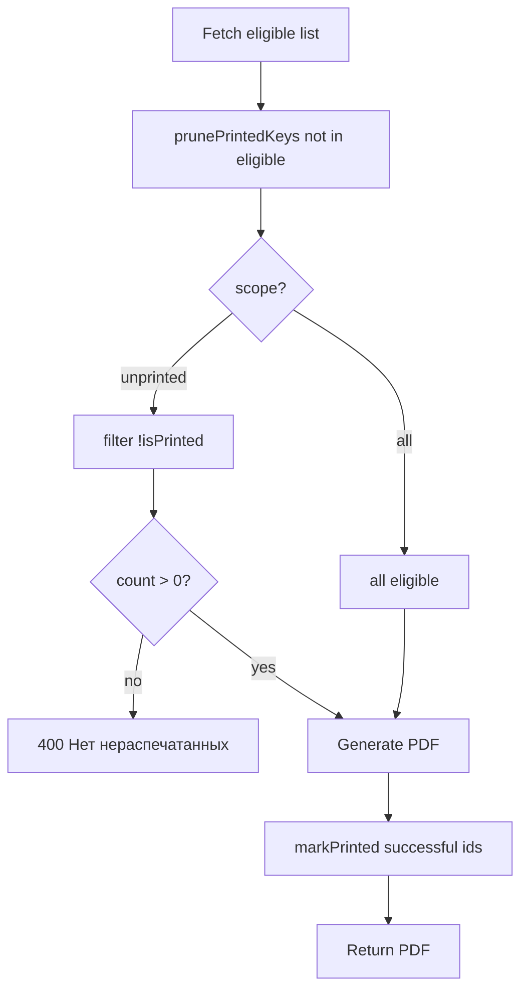

# Creative: Stickers — split UI + локальный учёт «нераспечатанных»

**Feature:** `stickers-ozon-unprinted-filter`  
**Тип:** UI/UX + persistence algorithm  
**Дата:** 2026-09-04  
**Статус:** Решение принято

Связано: `memory-bank/tasks.md`, live probe в PLAN (Ozon API не отдаёт «скачано в ЛК»)

---

## 🎨🎨🎨 ENTERING CREATIVE PHASE: UI/UX + ALGORITHM

**Focus:** два блока маркетплейсов, по 2 кнопки; локальный store после скачивания PDF у нас  
**Objective:** оператор качает только новые этикетки, не дублируя уже скачанные из этого приложения  
**Constraints:** Ozon/WB кабинет API не синхронизируем; `clay-card` / `clay-btn`; не трогать orders-сервисы

### Locked (user CREATIVE)

1. Split UI: блок **Ozon** + блок **Wildberries**
2. В каждом блоке: **«Все этикетки»** + **«Нераспечатанные»**
3. Локальный учёт после успешного скачивания PDF **из этого приложения**
4. Hint: не отслеживает печать/скачивание из кабинета МП

---

## OPTIONS ANALYSIS

### Option 1: Один JSON, один сервис `printedLabelsService` *(рекомендуется)*

**Storage:** `backend/storage/printed-labels.json`

```json
{
  "ozon": {
    "70679248-0294-7": "2026-09-04T12:00:00.000Z"
  },
  "wb": {
    "5414910358": "2026-09-04T12:05:00.000Z"
  }
}
```

**Keys:** Ozon → `posting_number`; WB → `orderId` string.

**Pros:** один prune/mark API; симметрия Ozon/WB; мало файлов  
**Cons:** один файл на оба МП (ок для single-instance backend)

### Option 2: Два JSON (`ozon-printed.json`, `wb-printed.json`)

**Pros:** изоляция  
**Cons:** дублирование кода read/write/prune

### Option 3: Browser localStorage

**Pros:** без backend state  
**Cons:** не переживает смену браузера/ПК; плохо для склада

**Decision:** Option 1.

---

## UI/UX OPTIONS

### Layout A: Два подблока в одной `clay-card` *(рекомендуется)*

```
┌─ clay-card ─────────────────────────────────────┐
│ Ozon                                            │
│   [Все этикетки]  [Нераспечатанные]             │
│ ─────────────────────────────────────────────── │
│ Wildberries                                     │
│   [Все этикетки]  [Нераспечатанные]             │
│                                                 │
│ hint: статусы, 58×40, локальный учёт            │
└─────────────────────────────────────────────────┘
```

- Заголовок блока: `h2.stickers-marketplace-title` (как подсекции на `/orders`)
- Кнопки: primary `clay-btn` = «Все», secondary `clay-btn clay-btn-secondary` = «Нераспечатанные»
- Loading: `ozon-all` | `ozon-unprinted` | `wb-all` | `wb-unprinted` — одна активная, остальные disabled
- Status line: «Скачано N этикеток Ozon (нераспечатанные)»

### Layout B: Две отдельные `clay-card`

**Pros:** визуально сильнее разделение  
**Cons:** лишняя высота, hint дублируется

**Decision:** Layout A.

---

## ALGORITHM

### Scope (query)

```
POST /api/marketplace/stickers/ozon?scope=all        # default
POST /api/marketplace/stickers/ozon?scope=unprinted
POST /api/marketplace/stickers/wb?scope=all
POST /api/marketplace/stickers/wb?scope=unprinted
```

### Flow



### Когда помечать «распечатано»

- Только ID, **реально попавшие в PDF** (не в `skipped`)
- И для `scope=all`, и для `scope=unprinted` — после успешного ответа
- Повторное скачивание «Все» — idempotent update `printedAt`

### Prune

После fetch eligible list:

```ts
pruneMarketplace(mp, currentIds: string[])
// удалить из JSON ключи mp, которых нет в currentIds
```

Заказ ушёл из `awaiting_deliver` / «на сборке» → запись исчезает → при возврате снова «нераспечатанный» (редко; ок).

### Ошибки

| Ситуация | HTTP |
|----------|------|
| `scope=unprinted`, 0 после фильтра | 400 «Нет нераспечатанных этикеток Ozon/WB» |
| нет кредов / нет заказов | как сейчас |

---

## IMPLEMENTATION GUIDELINES

### New: `backend/src/services/printedLabelsService.ts`

```ts
type MarketplacePrinted = 'ozon' | 'wb';

isPrinted(mp, id: string): boolean
markPrinted(mp, ids: string[]): void
pruneMarketplace(mp, currentIds: string[]): void
filterUnprinted(mp, ids: string[]): string[]
```

Sync `fs.readFileSync` / `writeFileSync` — как warehouse meta; single Node instance.

### Touch

| Файл | Изменение |
|------|-----------|
| `ozonLabelsService.ts` | `scope`, filter, return `printedIds` for mark |
| `wbLabelsService.ts` | то же для `order.id` |
| `stickersService.ts` | `generateStickers(mp, { scope })` + mark + prune |
| `marketplace.ts` | `req.query.scope` |
| `StickersPage.tsx` | 2 блока × 2 кнопки |
| `client.ts` | `generateStickers(mp, { scope })` |
| `global.css` | `.stickers-marketplace-block`, divider |
| `printedLabelsService.test.ts` | mark, prune, filter |
| `docs/features/stickers.md` | scope + disclaimer |

### Hint (locked copy)

> Нераспечатанные — этикетки, которые ещё не скачивали **из этого приложения**. Скачивание в кабинете Ozon/WB не учитывается.

Статусы: Ozon «Готово к отгрузке», WB «на сборке». Печать 58×40 @ 100%.

---

## Verification

| Требование | Покрытие |
|------------|----------|
| Split Ozon / WB | Layout A |
| 2 кнопки на МП | Все + Нераспечатанные |
| Локальный учёт | Option 1 JSON |
| WB symmetry | тот же `printedLabelsService` |
| Честность про ЛК | hint |
| Не ломать all-flow | `scope=all` default |

---

## 🎨🎨🎨 EXITING CREATIVE PHASE

**Summary:** одна `clay-card`, два блока, 4 кнопки; `printed-labels.json`; `?scope=unprinted`; mark+prune в `stickersService`.  
**Next:** `/build`
